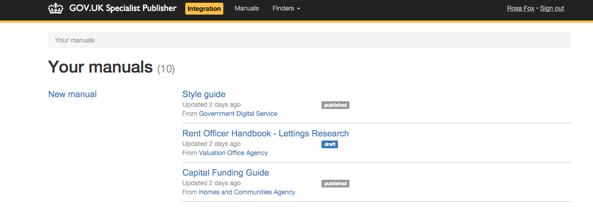
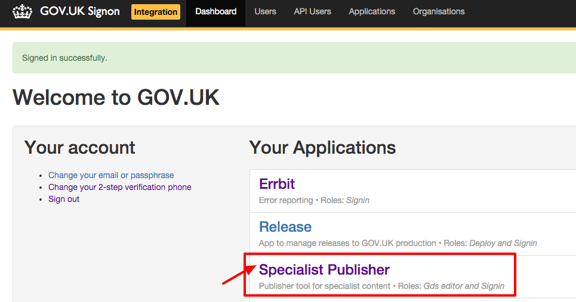
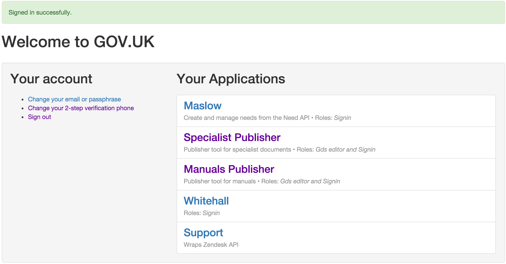
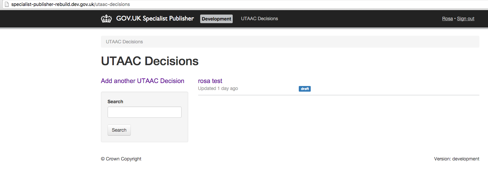
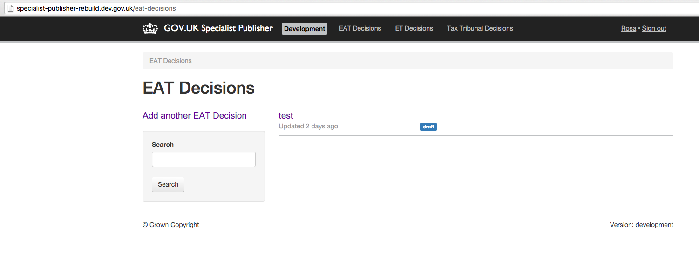
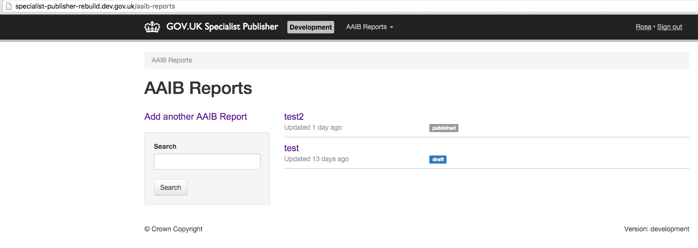
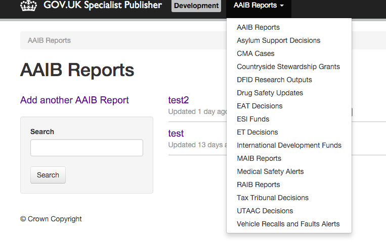
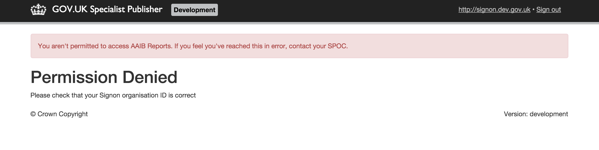
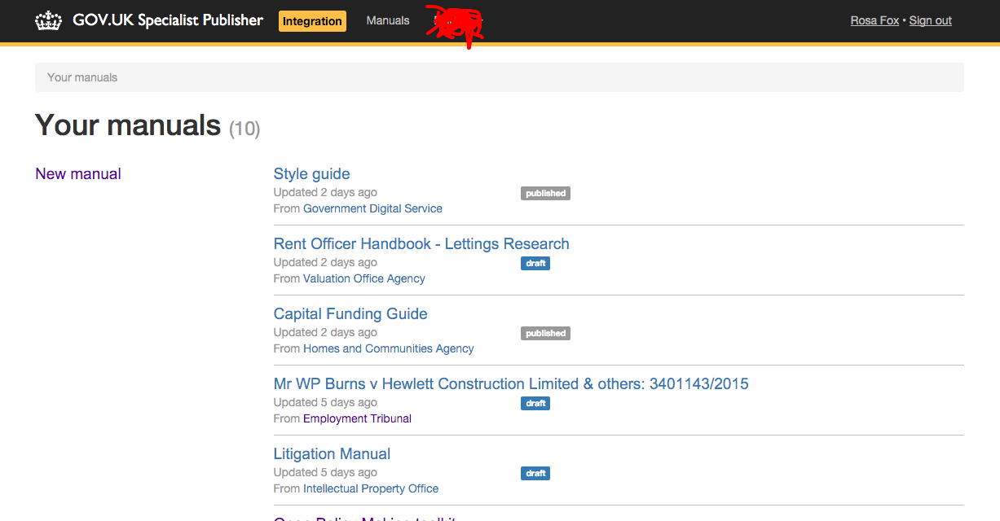

# Mockups

We are planning to separate the Specialist Publisher Finders and Manuals into separate applications.

This is how Specialist-Publisher V2 currently looks when a `gds_editor` logs in:
The `/manuals` page is the landing page (root url).

Currently a user would access the Specialist Publisher app to access both manuals and finders via Signon:

In future they will access the apps separately via signon:

We needed to decide what the new landing page would be for the Finders app, as it can no longer be `/manuals`:

- For users who have access to only 1 finder, we display their finder page as the landing page on arrival to the landing page
- For users who have access to more than 1 finder, we display the 1st finder to which they have access to as the default landing page to the user. The user can always go to the menu and change to a different page if necessary
- Manuals will not be displayed as the default landing page to the users
- Sign on page to show the relevant link based on user access

## Finders Publisher

The Finders application will be named 'Specialist Publisher'. Providing the user has been granted access, there will be a link to Specialist Publisher in their list of available apps in Sign On.

- If a user has access to 1 finder, then that finder page will be the landing page.

This user only has access to the UTAAC format:

- If a user's organisation contains multiple finders then they will appear in alphabetical order in the nav.

it will look similar to this:

- If a user is a `gds_editor` then they will have access to all finders. The landing page will be aaib-reports as this is the first alphabetically.

- In the unlikely case that the user has an `organisation_content_id` which is not recognised by the application, they will be redirected to an `/error` page.

## Manuals Publisher (name TBC!)

Providing the user has been granted access, there will be a link to the Manuals Publisher in the list of available apps in Sign On.

The home page will be the `/manuals` page.

[Here is a link to the code which rips out manuals from Specialist Publisher (1st commit) and displays the homepage as described here](https://github.com/alphagov/specialist-publisher-rebuild/pull/902)
